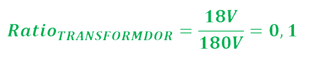

# Fonte de Tensão Variável (3V-12V | 100mA) criada para a matéria SSC0180 Eletrônica para Computação
Criação de uma fonte, ligada em 127V AC (60Hz), que produza, na saída, uma tensão ajustável entre 3V-12V, com uma corrente contínua de 100mA a 12V.

# Diagrama da Fonte

### Gráficos da Simulação

### Link para o Circuito
https://tinyurl.com/yhocpyjx

### Componentes do Circuito
**Transformador:** A tomada (entrada da fonte) fornece um RMS de 127V (pico em 180V). Como nossa fonte deve fornecer uma tensão máxima de 12V, o transfomador reduzirá essa voltagem original para ~12,7 (pico em 18V).

**Ponte de Diodos (retificação):** A ponte de diodos faz com que a voltagem seja sempre positiva. Assim, ela irá variar de 18V (pico) a 0V, ao invés de variar de 18V a -18V. *É preciso levar em conta que a cada diodo, do modelo usado, tem um drop voltage de ~0.6V. Com isso, após passar pela ponte a voltagem fica com um pico de ~16,8V.*

**Capacitor (filtragem):** O capacitor diminui a variação na voltagem. O que antes variava de ~16,8V a 0V, agora será mantido sempre acima de ~13V, porém ainda com um *ripple*.
<!-- Cálculo capacitor-->

**Diodo Zenner (regulador):** O diodo zenner consegue manter uma uma tensão X sobre ele, contanto que a tensão sobre ele seja >= X. Nesse caso, escolhemos um diodo de 13V, o que implica que, como nossa voltagem é sempre >= ~13V, graças ao capacitor, o Zenner manterá sempre os 13V sobre ele.

**Potenciômetro:** O potenciômero fará a regulação da voltagem na saída. Sua resistência está relacionada à voltagem mínima (3V) que buscamos na saída.
<!-- Cálculo potenciômetro -->

**Transistor:** O transistor vem para solucionar um grande impasse: se tivermos um resistor muito pequeno antes do Diodo Zenner, podemos queimá-lo. Se aumentarmos esse resistor, ficamos com uma tensão baixa demais. Portanto, adicionamos o transistor, que fornece um caminho alternativo para a corrente, enquanto a voltagem ainda é fornecida pelo Zenner. *Observação: o transistor tem um drop voltage de ~0,7V.*

# Tabela de Componentes
| QUANTIDADE | COMPONENTES                      | ESPECIFICAÇÕES                                                                                         | VALOR   |
|------------|----------------------------------|--------------------------------------------------------------------------------------------------------|---------|
|            |                                  |                                                                                                        |         |
| 1          | Transformador                    | 12V e 200mA                                                                                            | [R$26,99](https://produto.mercadolivre.com.br/MLB-989883391-transformador-trafo-1212v-200ma-bivolt-eletronica-eletrica-_JM?quantity=1#position=1&type=item&tracking_id=9abf8c61-6492-4e02-bb1d-d1a22f9b055d) |
| 4          | Diodo                            | Diodo retificador 1N4007 Corrente: 1A (máx 30A) Tensão Reversa: 1000V Encapsulamento: DO41 Drop ~ 0.6V | [R$0,09](https://www.baudaeletronica.com.br/diodo-1n4007.html?gclid=Cj0KCQjw9O6HBhCrARIsADx5qCTZRs8827yWnuqn_rv3Ij3qEQxVY_09_uGePRtv_29eelllDUmAbkMaAg4UEALw_wcB)  |
| 1          | Capacitor                        | Capacitor Eletrolitico 560uF/35V 105º 10x20mm Jamicon                                                  | [R$33,00](https://produto.mercadolivre.com.br/MLB-1475170977-20x-capacitor-eletrolitico-560uf35v-105-10x20mm-jamicon-_JM#position=11&search_layout=grid&type=item&tracking_id=d6712f2f-4ab5-47d6-9b20-7cae78e0499e) |
| 1          | Resistor 820Ω                    | Resistor 820R 5% (1/4W)                                                                                | [R$0,05](https://www.baudaeletronica.com.br/resistor-820r-5-1-4w.html?gclid=Cj0KCQjw9O6HBhCrARIsADx5qCR9RudG1rP_FJgogkOfkfuI2sWdrbxFK0PX21QT6X16g423rBAzVqQaAsp8EALw_wcB)  |
| 1          | Resistor 2.2kΩ                   | Resistor 2K2 5% (1/4W)                                                                                 | [R$0,05](https://www.baudaeletronica.com.br/resistor-2k2-5-1-4w.html?gclid=Cj0KCQjw9O6HBhCrARIsADx5qCRo7-vCXXH33RctZq-iOnZyAB6-hpCe7Pgjyf3LAdWZnwHJX3g_CeoaAjy7EALw_wcB)  |
| 1          | Diodo Zener                      | Diodo Zener 1N4743 [13V / 1W]                                                                          | [R$0,19](https://www.baudaeletronica.com.br/diodo-zener-1n4743-13v-1w.html?gclid=Cj0KCQjw9O6HBhCrARIsADx5qCRGEg7XYb5aGn0Z1I7SknzJJUa22MIMlAllDVkbJLwXGaiSqqB_TRgaAr4zEALw_wcB)  |
| 1          | Potenciômetro                    | Resistência: 5K (5000Ω) Potência: 0,2W Tipo: Linear Rotativo Tensão Máxima: 200V AC                    | [R$1,99](https://www.baudaeletronica.com.br/potenciometro-linear-de-5k-5000.html?gclid=Cj0KCQjw9O6HBhCrARIsADx5qCTMHQAI6sTi7lzOAkH93KXrArQTBYsat9axisSIV9KvZKRZh8o5E2gaAq9zEALw_wcB)  |
| 1          | Transistor NPN                   | Transistor NPN - BC548 Tensão Coletor Emissor = 30V Tensão Coletor Base = 30V Tensão Emissor Base = 5V | [R$0,17](https://www.baudaeletronica.com.br/transistor-npn-bc548.html?gclid=Cj0KCQjw9O6HBhCrARIsADx5qCTKld_1td4uUaTiKCKmKWoJH7SuCkTWpAj7Gklsygzx7BwEpjZNft0aAkPSEALw_wcB) |

*Observação: Uma alternativa para os 4 diodos é usar uma ponte retificadora pronta. Porém, ela custa [R$3,67](https://www.baudaeletronica.com.br/ponte-retificadora-kbpc1010.html?gclid=Cj0KCQjw9O6HBhCrARIsADx5qCQYwFLU2LKIdpeqMmVVPR_0hlOLdElUAwMhi0hp5ZJfor1AFRECoXEaAkDmEALw_wcB) (mais cara que comprar 4 diodos).*

# Esquemático e PCB no Eagle
<!-- Adicionar Imagem -->

# Cálculos dos Valores
<!-- Adicionar Cálculos-->

# Vídeo explicativo
<!-- Adiciona Vídeo -->
